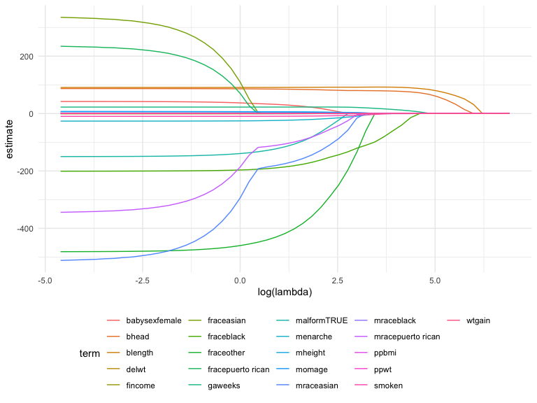
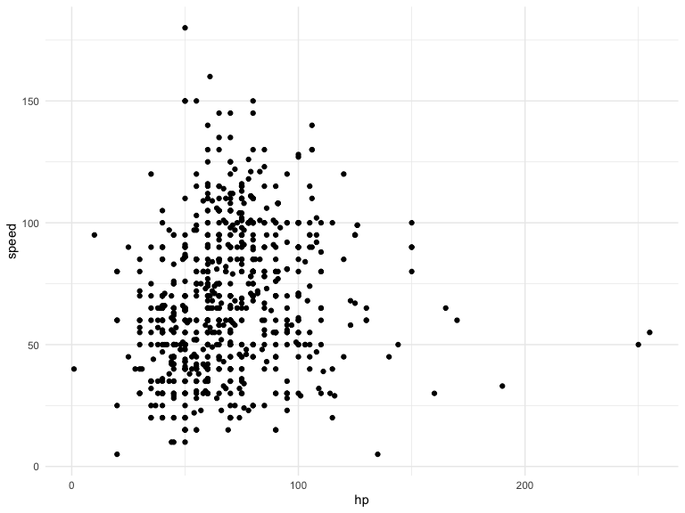
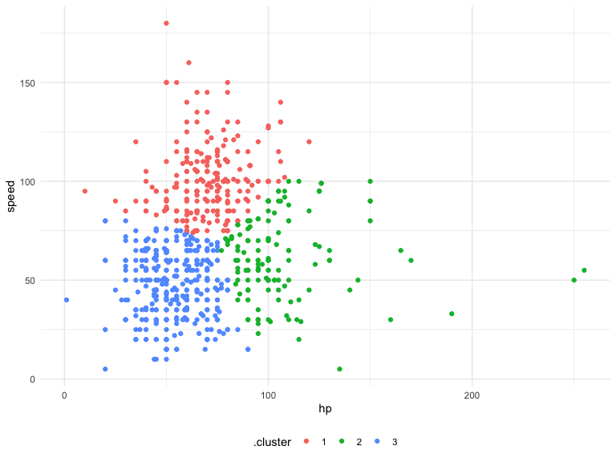
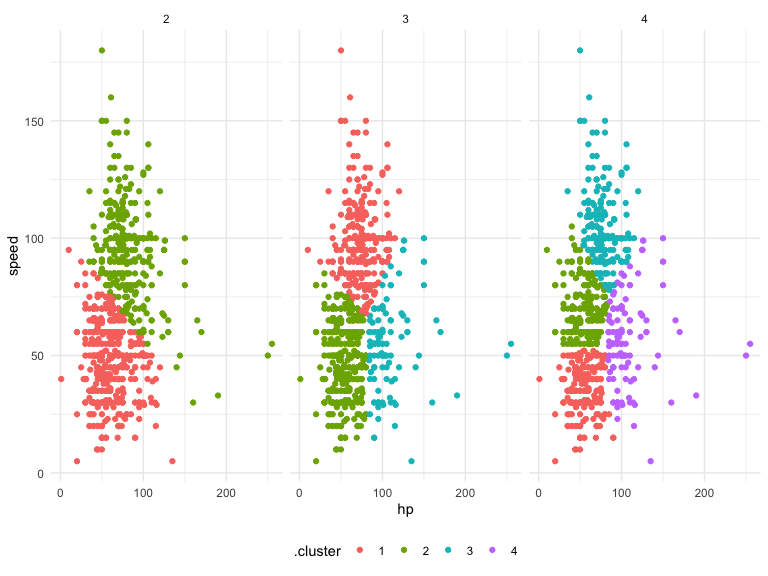
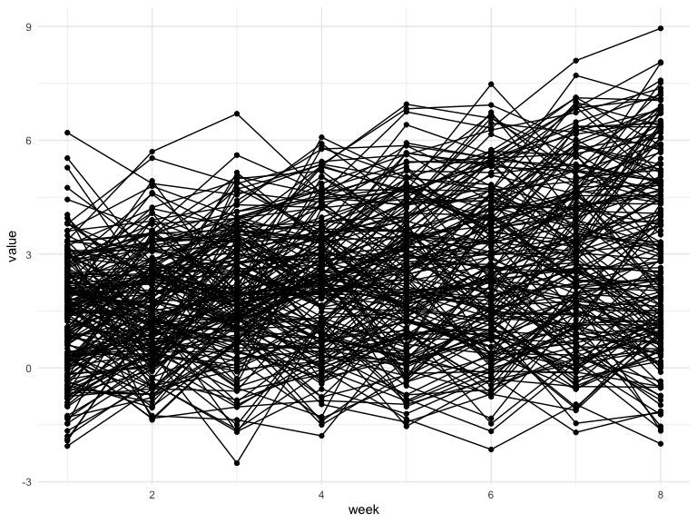
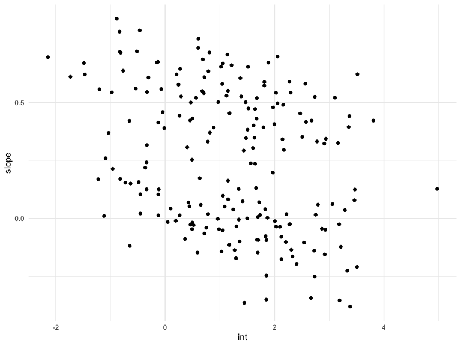
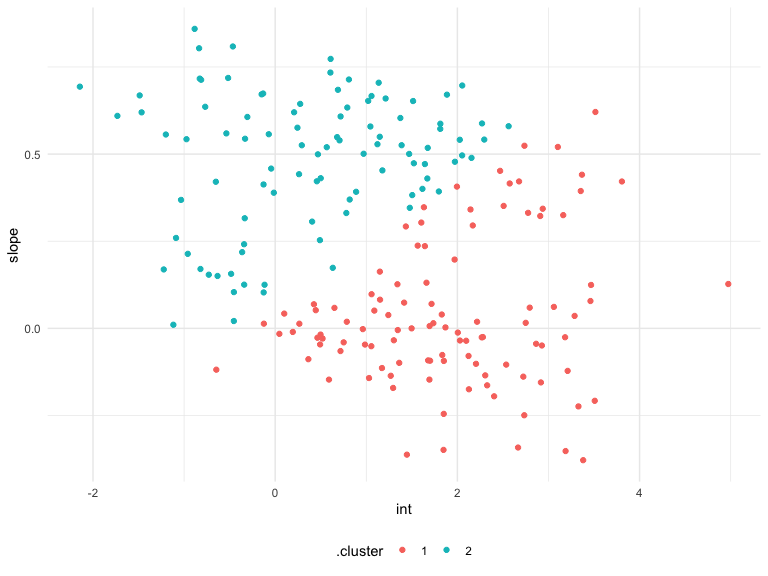
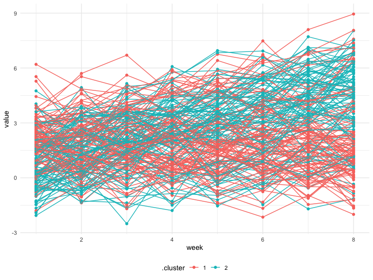

DSextra3
================
Hening CUi
12/3/2021

    ## ── Attaching packages ─────────────────────────────────────── tidyverse 1.3.1 ──

    ## ✓ ggplot2 3.3.5     ✓ purrr   0.3.4
    ## ✓ tibble  3.1.5     ✓ dplyr   1.0.7
    ## ✓ tidyr   1.1.4     ✓ stringr 1.4.0
    ## ✓ readr   2.0.2     ✓ forcats 0.5.1

    ## ── Conflicts ────────────────────────────────────────── tidyverse_conflicts() ──
    ## x dplyr::filter() masks stats::filter()
    ## x dplyr::lag()    masks stats::lag()

    ## Loading required package: Matrix

    ## 
    ## Attaching package: 'Matrix'

    ## The following objects are masked from 'package:tidyr':
    ## 
    ##     expand, pack, unpack

    ## Loaded glmnet 4.1-2

## Lasso

prediction birthweight

``` r
bwt_df = 
  read_csv("birthweight.csv") %>% 
  janitor::clean_names() %>%
  mutate(
    babysex = as.factor(babysex),
    babysex = fct_recode(babysex, "male" = "1", "female" = "2"),
    frace = as.factor(frace),
    frace = fct_recode(frace, "white" = "1", "black" = "2", "asian" = "3", 
                       "puerto rican" = "4", "other" = "8"),
    malform = as.logical(malform),
    mrace = as.factor(mrace),
    mrace = fct_recode(mrace, "white" = "1", "black" = "2", "asian" = "3", 
                       "puerto rican" = "4")) %>% 
  sample_n(200)
```

    ## Rows: 4342 Columns: 20

    ## ── Column specification ────────────────────────────────────────────────────────
    ## Delimiter: ","
    ## dbl (20): babysex, bhead, blength, bwt, delwt, fincome, frace, gaweeks, malf...

    ## 
    ## ℹ Use `spec()` to retrieve the full column specification for this data.
    ## ℹ Specify the column types or set `show_col_types = FALSE` to quiet this message.

do lasso

``` r
y = bwt_df %>% pull(bwt)
x = model.matrix(bwt ~., bwt_df)[, -1]
```

``` r
lambda_grid = 10 ^ seq(3, -2, by = -0.1)
lasso_fit = glmnet(x, y, lambda = lambda_grid)
lasso_cv = cv.glmnet(x, y, lambda = lambda_grid)
lambda_opt = lasso_cv$lambda.min
```

``` r
lasso_fit %>% 
  broom::tidy() %>% 
  complete(term, lambda, fill = list(estimate = 0)) %>% 
  filter(term != "(Intercept)") %>% 
  ggplot(aes(x = log(lambda), y = estimate, group = term, color = term)) +
  geom_path()
```



## cluster pokeman

``` r
pokemon_df =
  read_csv("pokemon.csv") %>% 
  janitor::clean_names() %>% 
  select(speed, hp)
```

    ## Rows: 800 Columns: 13

    ## ── Column specification ────────────────────────────────────────────────────────
    ## Delimiter: ","
    ## chr (3): Name, Type 1, Type 2
    ## dbl (9): #, Total, HP, Attack, Defense, Sp. Atk, Sp. Def, Speed, Generation
    ## lgl (1): Legendary

    ## 
    ## ℹ Use `spec()` to retrieve the full column specification for this data.
    ## ℹ Specify the column types or set `show_col_types = FALSE` to quiet this message.

quick look

``` r
pokemon_df %>% 
  ggplot(aes(x = hp, y = speed)) + geom_point()
```



K-means to identify cluster

``` r
kmeans_fit =
  kmeans(x = pokemon_df, centers = 3)
```

``` r
pokemon_df %>% 
  broom::augment(kmeans_fit, .) %>% 
  ggplot(aes(x = hp, y = speed, color = .cluster)) + 
  geom_point()
```



``` r
clusts =
  tibble(k = 2:4) %>%
  mutate(
    km_fit =    map(k, ~kmeans(pokemon_df, .x)),
    augmented = map(km_fit, ~broom::augment(.x, pokemon_df))
  )

clusts %>% 
  select(-km_fit) %>% 
  unnest(augmented) %>% 
  ggplot(aes(hp, speed, color = .cluster)) +
  geom_point(aes(color = .cluster)) +
  facet_grid(~k)
```



## cluster intercept and slope

``` r
traj_data = 
  read_csv("trajectories.csv")
```

    ## Rows: 1600 Columns: 3

    ## ── Column specification ────────────────────────────────────────────────────────
    ## Delimiter: ","
    ## dbl (3): subj, week, value

    ## 
    ## ℹ Use `spec()` to retrieve the full column specification for this data.
    ## ℹ Specify the column types or set `show_col_types = FALSE` to quiet this message.

``` r
traj_data %>% 
  ggplot(aes(x = week, y = value, group = subj)) + 
  geom_point() + 
  geom_path()
```



``` r
int_slope_df = 
  traj_data %>% 
  nest(data = week:value) %>% 
  mutate(
    models = map(data, ~lm(value ~ week, data = .x)),
    result = map(models, broom::tidy)
  ) %>% 
  select(subj, result) %>% 
  unnest(result) %>% 
  select(subj, term, estimate) %>% 
  pivot_wider(
    names_from = term,
    values_from = estimate
  ) %>% 
  rename(int = "(Intercept)", slope = week)
```

``` r
int_slope_df %>% 
  ggplot(aes(x = int, y = slope)) + 
  geom_point()
```



``` r
km_fit = 
  kmeans(
    x = int_slope_df %>% select(-subj) %>% scale, 
    centers = 2)

int_slope_df =
  broom::augment(km_fit, int_slope_df)
```

``` r
int_slope_df %>% 
  ggplot(aes(x = int, y = slope, color = .cluster)) +
  geom_point()
```



``` r
left_join(traj_data, int_slope_df) %>% 
  ggplot(aes(x = week, y = value, group = subj, color = .cluster)) + 
  geom_point() + 
  geom_path() 
```

    ## Joining, by = "subj"


